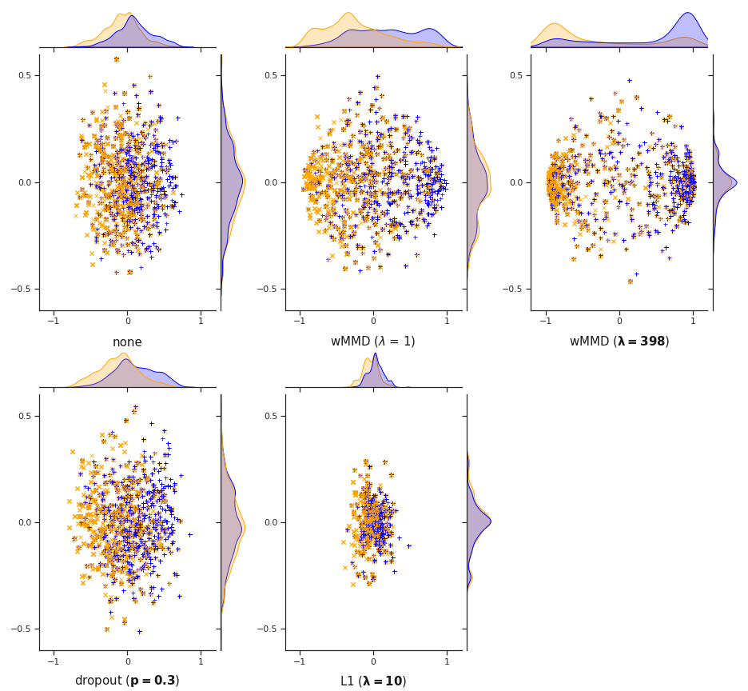

## Word-level Maximum Mean Discrepancy Regularization for Word Embedding

<!-- Authors: [Youqian Gao](https://github.com/youqiangao), [Ben Dai](https://www.bendai.org/) -->

### Introduction

The technique of word embedding is widely used in natural language processing to represent words as numerical vectors in textual datasets. However, the estimation of word embedding may suffer from severe overfitting due to the huge variety of words. 

Word-level maximum mean discrepancy (**WMMD**) is a novel regularization framework that recognizes and accounts for the "word-level distribution discrepancy"–a common phenomenon in a range of NLP datasets where word distributions are noticeably disparate under different labels. The regularization serves a specific purpose: to enhance/preserve the distribution discrepancies within word embedding numerical vectors and thus prevent overfitting.

We visualize the embedding of a CNN model trained on the CE-T1 dataset, with different regularization. The **WMMD** regularization separates the word vectors under different labels and enforces the word-level discrepancy between the two groups. The degree of the discrepancy increases as the weight of **WMMD** regularization gets larger.

<p align="center">
    
</p>

### Motivation

The word clouds show significant differences in the most common words between the "sports" and "business" categories in the BBC News dataset. Observing the word-level distribution discrepancy in the dataset, a good embedding should result in numerical word representations that maintain the word-level distribution discrepancy.

<p align="center">
    
</p>


### Setup
```shell
pip install -r requirements.txt
```

### Running the WMMD code
```shell
python main.py dataset=<dataset> model=<model> regularizer=<regularizer>
```
For more details, refer to `python main.py --help`. Currently, the learning framework supports the following configurations:
1. dataset: bbc-news, ce-t1, sim1, sim2, sim3 (check the paper for more details on three simulation examples)
2. model: cnn, bilstm, gru, mlp, logistic
3. regularizer: wmmd, swmmd (structured wmmd), biwmmd (bigram wmmd), dropout, l1, none

